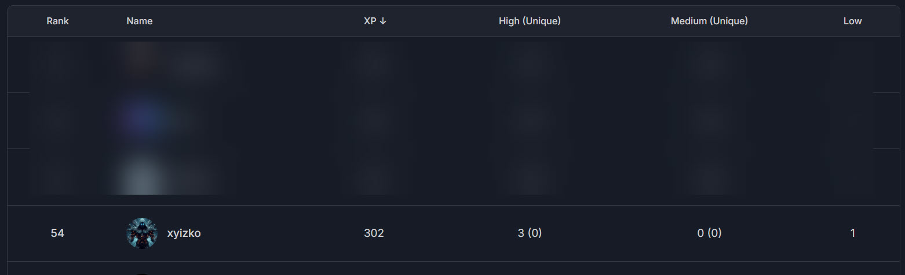

<h1 align="center"><code> cffisc </code></h1>
<h2 align="center"><i> Cyfrin First Flight - Inheritable Smart Contract Wallet</i></h2>

1. [What ?](#what-)
2. [Rank](#rank)
   1. [Reports Table](#reports-table)

# What ? 

Reports from participating in [`Cyfrin Codehawks - Rust Fund`](https://codehawks.cyfrin.io/c/2025-03-inheritable-smart-contract-wallet)

# Rank

Emoji | Description | Stats
:--: | :--: | :--:
💀 | Critical 
🔥 | High | 3
⚠️ | Medium 
❗ | Low
💡 | Insight

## Reports Table 

Ref | Severity | Program | What
:--: | :--: | :--: | :--: 
[`cffisc001`](./cffisc001.md) | 🔥 | [Cyfrin First Flights - Inheritable Smart Contract Wallet](https://codehawks.cyfrin.io/c/2025-03-inheritable-smart-contract-wallet) | [*Improper handling of deleting elements from the beneficiary array.*](./cffisc001.md)
[`cffisc002`](./cffisc002.md) | 🔥 | [Cyfrin First Flights - Inheritable Smart Contract Wallet](https://codehawks.cyfrin.io/c/2025-03-inheritable-smart-contract-wallet) | [*buyOutEstateNFT Function issues*](./cffisc002.md)
[`cffisc003`](./cffisc003.md) | 🔥 | [Cyfrin First Flights - Inheritable Smart Contract Wallet](https://codehawks.cyfrin.io/c/2025-03-inheritable-smart-contract-wallet) | [*Custom reentrancy modifier fails to provide protection*](./cffisc003.md)
