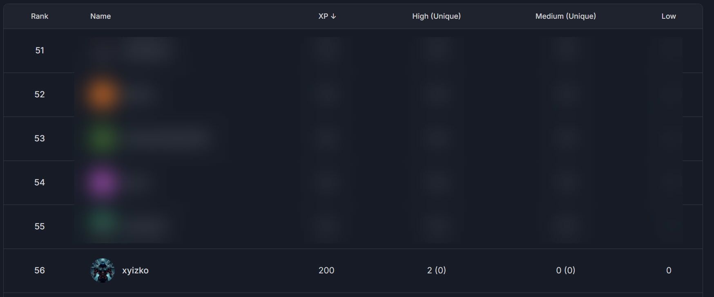

<h1 align="center"><code> cffrf </code></h1>
<h2 align="center"><i> Cyfrin First Flight - Rust Fund </i></h2>

1. [What ?](#what-)
   1. [Rank](#rank)
   2. [Reports Table](#reports-table)

# What ? 

Reports from participating in [`Cyfrin Codehawks Rust Funds`](https://codehawks.cyfrin.io/c/2025-03-rustfund)

## Rank 

Emoji | Description | Stats
:--: | :--: | :--:
💀 | Critical 
🔥 | High | 1
⚠️ | Medium 
❗ | Low
💡 | Insight

## Reports Table 

Ref | Severity | Program | What
:--: | :--: | :--: | :--: 
[`cffrf001`](./cffrf001.md) | 🔥 | [`Cyfrin Codehawks Rust Funds`](https://codehawks.cyfrin.io/c/2025-03-rustfund) | [*(Medium) Lack of withdrawal condition check*](./cffrf001.md)
