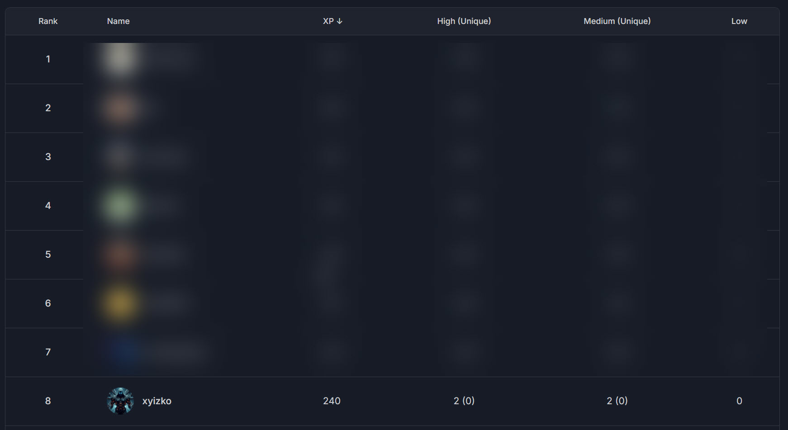

<h1 align="center"><code> cffrpa </code></h1>
<h2 align="center"><i> Cyfrin First Flights - Rock Paper Scissors </i></h2>

1. [What ?](#what-)
   1. [Rank](#rank)
   2. [Reports Table](#reports-table)

# What ? 

Reports from participating in [`Cyfrin Codehawks - First Flights - Rock Paper Scissors`](https://codehawks.cyfrin.io/c/2025-04-rock-paper-scissors)

## Rank 

Emoji | Description 
:--: | :--:
💀 | Critical 
🔥 | High
⚠️ | Medium 
❗ | Low
💡 | Insight

## Reports Table 

Ref | Severity | Program | What
:--: | :--: | :--: | :--: 
[`cffrpa001`](./cffrpa001.md) | 🔥 | [`Cyfrin Codehawks - First Flights - Rock Paper Scissors`](https://codehawks.cyfrin.io/c/2025-04-rock-paper-scissors) | [*(HIGH) Denial of Service on Prize/Refund*](./cffrpa001.md)
