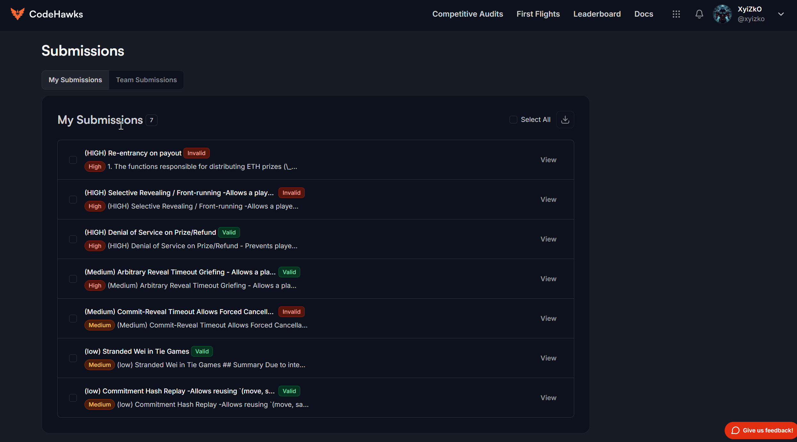

<h1 align="center"><code> cffrpa001 </code></h1>
<h2 align="center"><i>(HIGH) Denial of Service on Prize/Refund</i></h2>
<h3 align="center"><i> 🔥 Severity HIGH</i></h3>

1. [Bugs Found](#bugs-found)
2. [Summary](#summary)
3. [Vulnerability Details](#vulnerability-details)
   1. [Exploitation Procedure](#exploitation-procedure)
4. [Impact](#impact)
5. [Recomendations](#recomendations)


# Bugs Found

[](https://profiles.cyfrin.io/u/xyizko)

# Summary 

1. The contract sends ETH prizes and refunds to players using low-level call calls with a success check (require(success, "Transfer failed");).
2. A malicious player can use a smart contract address that is designed to revert whenever it receives ETH. When the game attempts to send the prize or refund to this malicious address, the call will revert, which in turn causes the entire calling function (\_finishGame, \_handleTie, or \_cancelGame) to revert.
3. This prevents the game from finalizing correctly, potentially locking the ETH bets within the contract indefinitely for that specific game.


# Vulnerability Details

1. The RockPaperScissors contract manages ETH bets. At the end of a game (win, lose, or tie) or upon cancellation, it attempts to send ETH back to the players. This is done using `(bool success,) = playerAddress.call{value: amount}("")`; followed by `require(success, "Transfer failed");`.
2. If playerAddress belongs to a contract whose `receive()` or `fallback()` function reverts when called with value, the success variable will be false, and the require check will cause the entire function `(_finishGame, _handleTie, or _cancelGame)` to revert.
3. In `_finishGame`, if the transfer to the winner fails, the game state will not be marked as `Finished`, and the prize is not distributed.
4. In `_handleTie`, if either refund transfer fails , the game state will not be marked as Finished, and neither player receives their refund.
5. In `_cancelGame`, if either refund transfer fails, the game state will not be marked as Cancelled, and neither player receives their refund.

File: `src/RockPaperScissors.sol`
`(_finishGame function)`
<https://github.com/CodeHawks-Contests/2025-04-rock-paper-scissors/blob/main/src/RockPaperScissors.sol#L467-L505>

```solidity 
 /**
  * @dev Internal function to finish the game and distribute prizes
  * @param _gameId ID of the game
  * @param _winner Address of the winner
  */
 function _finishGame(uint256 _gameId, address _winner) internal {
     Game storage game = games[_gameId];
     game.state = GameState.Finished; // <-- State set BEFORE payout attempt
     uint256 prize = 0;
     // Handle ETH prizes
     if (game.bet > 0) {
         // Calculate total pot and fee
         uint256 totalPot = game.bet * 2;
         uint256 fee = (totalPot * PROTOCOL_FEE_PERCENT) / 100;
         prize = totalPot - fee;
         // Accumulate fees for admin to withdraw later
         accumulatedFees += fee;
         emit FeeCollected(_gameId, fee);
         // Send prize to winner
         (bool success,) = _winner.call{value: prize}("");
         require(success, "Transfer failed"); // <-- VULNERABLE LINE: Requires success of external call
     }
...
     emit GameFinished(_gameId, _winner, prize);
}
```

File: src/RockPaperScissors.sol
`(_handleTie function)`
<https://github.com/CodeHawks-Contests/2025-04-rock-paper-scissors/blob/main/src/RockPaperScissors.sol#L511-L530>

```solidity 
function _handleTie(uint256 _gameId) internal {
    Game storage game = games[_gameId];
    game.state = GameState.Finished; // <-- State set BEFORE payout attempt
    // Return ETH bets to both players, minus protocol fee
    if (game.bet > 0) {
        // Refund both players
        (bool successA,) = game.playerA.call{value: refundPerPlayer}("");
        (bool successB,) = game.playerB.call{value: refundPerPlayer}("");
        require(successA && successB, "Transfer failed"); // <-- VULNERABLE LINE: Requires success of external calls
    }
...
}
```
File: src/RockPaperScissors.sol
(\_cancelGame function)
<https://github.com/CodeHawks-Contests/2025-04-rock-paper-scissors/blob/main/src/RockPaperScissors.sol#L547-L561>

```solidity 
function _cancelGame(uint256 _gameId) internal {
    Game storage game = games[_gameId];
    game.state = GameState.Cancelled; // <-- State set BEFORE payout attempt
    // Refund ETH to players
    if (game.bet > 0) {
        (bool successA,) = game.playerA.call{value: game.bet}("");
        require(successA, "Transfer to player A failed"); // <-- VULNERABLE LINE: Requires success of external call
    if (game.playerB != address(0)) {
        (bool successB,) = game.playerB.call{value: game.bet}("");
        require(successB, "Transfer to player B failed"); // <-- VULNERABLE LINE: Requires success of external call
    }
    }
}
```

## Exploitation Procedure 

1. Deploy a simple smart contract that has a receive() or fallback() function which simply reverts.
   Use the address of this malicious contract as playerA or playerB when creating or joining an ETH-based game (createGameWithEth or joinGameWithEth).
2. Participate in the game until it reaches a state where ETH payout/refund is triggered (i.e., the game finishes due to scores or timeout, or is cancelled).
3. Wait for the contract to attempt to send ETH to the malicious player address. This transaction will revert, causing the game finalization/cancellation logic to fail entirely.

# Impact 

1. Impact A malicious player (either player A or player B) can grief a game by using a contract address that prevents the final ETH distribution. This leads to:
   1. Locked Funds: The ETH deposited as bets for that game remains trapped in the RockPaperScissors contract.
   2. Game Bricking: The game's state may not transition correctly to Finished or Cancelled if the payout is mandatory within the finalization logic. This particular contract sets the state before the transfer, but the require(success) causes the entire transaction to revert, including the state change. Thus, the state remains stuck in the previous phase (e.g., Committed if timed out reveal, Created if join timed out or manually cancelled before join).
   3. Reduced Protocol Reliability: Users may lose confidence if games get stuck and funds are inaccessible.

# Recomendations

Change the payment pattern from push (sending ETH to players automatically) to pull (requiring players to call a function to claim their prize/refund).

1. When a game finishes or is cancelled, instead of sending ETH directly, record the amount owed to each player in a mapping (e.g., mapping(uint256 => mapping(address => uint256)) public pendingPayouts;).
   Provide a new function, claimPayout(uint256 \_gameId), that players can call.
2. This function checks pendingPayouts\[\_gameId]\[msg.sender], sends the recorded amount to msg.sender using call{value: amount}(""), and sets the pending amount to zero regardless of the call's success. This way, a malicious receiver only prevents themselves from receiving funds and does not break the game finalization logic for the other player or lock funds for everyone.


