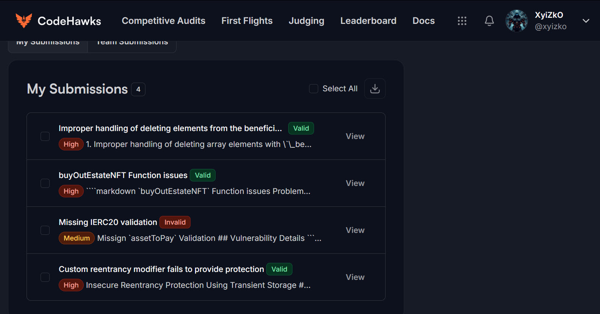

<h1 align="center"><code> cffisc003 </code></h1>
<h2 align="center"><i> Custom reentrancy modifier fails to provide protection </i></h2>
<h3 align="center"><i> 🔥 Severity HIGH</i></h3>


1. [Bugs Found](#bugs-found)
2. [Summary](#summary)
3. [Vulnerability Details](#vulnerability-details)
4. [Impact](#impact)
5. [Recommendations](#recommendations)

# Bugs Found

[](https://x.com/xyizko)

# Summary 

Insecure Reentrancy Protection Using Transient Storage

# Vulnerability Details

Insecure codeblock

```solidity 
modifier nonReentrant() {
    assembly {
        if tload(1) { revert(0, 0) } // Checks slot 1 (always 0)
        tstore(0, 1) // Sets lock in slot 0
    }
    _;
    assembly {
        tstore(0, 0) // Resets slot 0
    }
}
```

1. Mismatched Storage Slots:
   1. The modifier checks `slot 1` for the lock `(tload(1)`), but sets the lock in `slot 0` `(tstore(0, 1))`.
   2. 1. Since `slot 1` is never updated, the lock check `(if tload(1))` always passes , rendering the guard useless.
2. Reentrancy Vector:
   1. Functions like `sendETH` or `contractInteractions` can be re-entered during external calls (e.g., call{value: ...}), allowing attackers to drain funds.
   2. Transient Storage can also be overwritten by a separate contract, causing unforeseen issues.

# Impact

A successful reentrancy attack can lead to:

1. Fund Drainage: An attacker can repeatedly withdraw funds from the contract, exceeding the intended limits.
2. State Corruption: Critical state variables can be manipulated, leading to unpredictable behavior and potential denial-of-service.
3. Exploitation of Other Vulnerabilities: Reentrancy can be used as a stepping stone to exploit other vulnerabilities in the contract.

# Recommendations

Use openzepplin reentrancy guard, instead of a custom modifier
