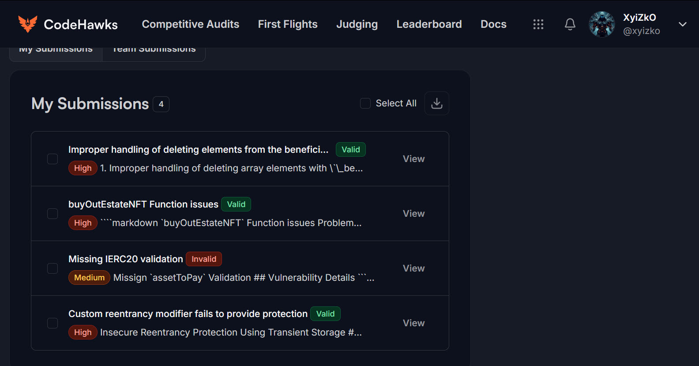

<h1 align="center"><code> cffisc001 </code></h1>
<h2 align="center"><i>Improper handling of deleting elements from the beneficiary array</i></h2>
<h3 align="center"><i> 🔥 Severity HIGH</i></h3>


1. [Bugs Found](#bugs-found)
2. [Summary](#summary)
3. [Vulnerability Details](#vulnerability-details)
4. [Impact](#impact)
5. [Recommendations](#recommendations)

# Bugs Found



# Summary 

Improper handling of deleting array elements with `_beneficiary` array 

# Vulnerability Details

```solidity 
function removeBeneficiary(address _beneficiary) external onlyOwner {
        uint256 indexToRemove = _getBeneficiaryIndex(_beneficiary);
        delete beneficiaries[indexToRemove];
    }
```

* Line 3 - The delete function will just 0 out that element in the array. Meaning there will be a hole in the array with a 0 address. Refer - [https://blog.finxter.com/how-to-delete-an-element-from-an-array-in-solidity/ .](https://blog.finxter.com/how-to-delete-an-element-from-an-array-in-solidity/)
* Subsequent operations on the \`beneficiary\` array will lead to errors

# Impact

Functions that use this array will lead to errors  such as the -

```solidity 
 function withdrawInheritedFunds(address _asset) external {
        if (!isInherited) {
            revert NotYetInherited();
        }
```

and this function 

```solidity 
 function buyOutEstateNFT(uint256 _nftID) external onlyBeneficiaryWithIsInherited {{
   .....
 }
```
# Recommendations

Proper handling of removing elements from the array
