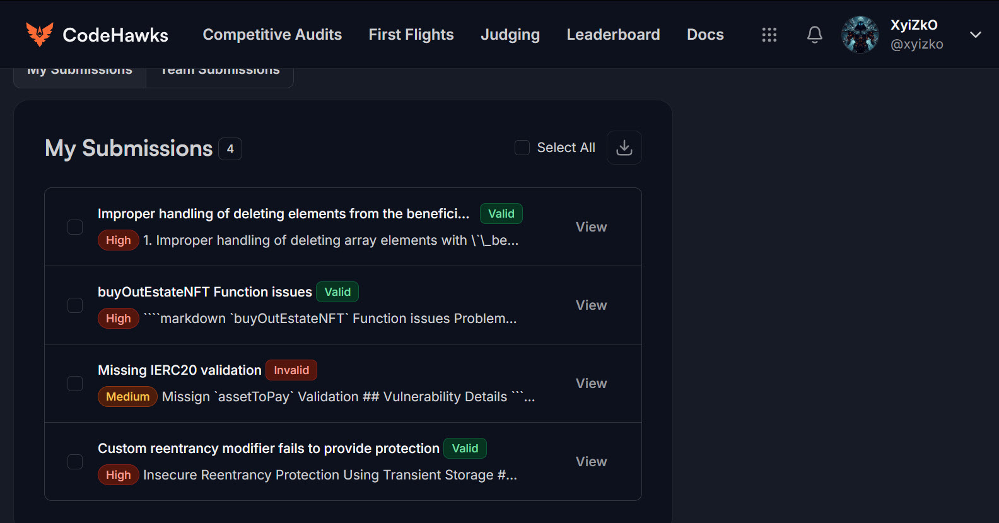

<h1 align="center"><code> cffisc002 </code></h1>
<h2 align="center"><i>buyOutEstateNFT Function issues</i></h2>
<h3 align="center"><i> 🔥 Severity HIGH</i></h3>


1. [Bugs Found](#bugs-found)
2. [Summary](#summary)
3. [Vulnerability Details](#vulnerability-details)
4. [Impact](#impact)
5. [Recommendations](#recommendations)

# Bugs Found



# Summary 

`buyOutEstateNFT` Function issues 

Problematic code 
```solidity 
function buyOutEstateNFT(uint256 _nftID) external onlyBeneficiaryWithIsInherited {
        uint256 value = nftValue[_nftID];
        uint256 divisor = beneficiaries.length;
        uint256 multiplier = beneficiaries.length - 1;
        uint256 finalAmount = (value / divisor) * multiplier;
        IERC20(assetToPay).safeTransferFrom(msg.sender, address(this), finalAmount);
        for (uint256 i = 0; i < beneficiaries.length; i++) {
            if (msg.sender == beneficiaries[i]) {
                return;
            } else {
                IERC20(assetToPay).safeTransfer(beneficiaries[i], finalAmount / divisor);
            }
        }
        nft.burnEstate(_nftID);
    }
```

# Vulnerability Details

1. Incomplete beneficiary payout due to looping logic flaw
2. Incorrect fun calculation (Truncation of remainder amounts)
3. Due to incorrect looping the `nft.burnEstate` is never reached, function can be called multiple times


# Impact

Impact 1 - Due to the loop termination flaw, When the sender is the beneficiary the loop exits and safe transfer isnt executed

Impact 2

```solidity 
.
.
 uint256 finalAmount = (value / divisor) * multiplier;
 .
 .
```

- Due to truncation of remainder amouts, incorrect amounts will be distributed

Impact 3 - Due to Impact 1 the function `nft.burnEstate(_nftID);` is never reached with `sender == beneficiary` this can be used as a replay attach since the this function can be called multiple times, and the nft never gets burned

# Recommendations

Fix 1 : Final amount calculation should take into account of remainder amounts

Fix 2 : Loop should still contiune in the event the `sender == benficiary` instead of exiting

Fix 3 : If fix 2 is implemented then Replay Attack issue will be resolved
