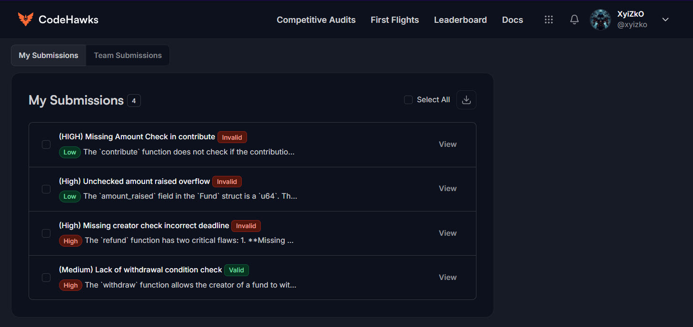

<h1 align="center"><code> cffrf001 </code></h1>
<h2 align="center"><i>(Medium) Lack of withdrawal condition check</i></h2>
<h3 align="center"><i> 🔥 Severity HIGH</i></h3>


1. [Bugs Found](#bugs-found)
2. [Summary](#summary)
3. [Vulnerability Details](#vulnerability-details)
4. [Impact](#impact)
5. [Recommendations](#recommendations)

# Bugs Found

[](https://x.com/xyizko)

# Summary 

The `withdraw` function allows the creator of a fund to withdraw *all* raised funds (`amount_raised`) without any checks on whether the campaign was successful (i.e., reached its `goal`) or whether the deadline has passed. This allows for premature and potentially malicious withdrawals.

# Vulnerability Details

The `withdraw` function (`programs/rustfund/src/lib.rs`,  simply transfers the entire `amount_raised` from the `fund` account to the `creator` account:

```rust 
pub fn withdraw(ctx: Context<FundWithdraw>) -> Result<()> {
    let amount = ctx.accounts.fund.amount_raised;

    **ctx.accounts.fund.to_account_info().try_borrow_mut_lamports()? =
        ctx.accounts.fund.to_account_info().lamports()
        .checked_sub(amount)
        .ok_or(ProgramError::InsufficientFunds)?;

    **ctx.accounts.creator.to_account_info().try_borrow_mut_lamports()? =
        ctx.accounts.creator.to_account_info().lamports()
        .checked_add(amount)
        .ok_or(ErrorCode::CalculationOverflow)?;

    Ok(())
}
```
There are *no* checks to ensure that:

1. `fund.amount_raised >= fund.goal` (the campaign was successful)
2. `Clock::get().unwrap().unix_timestamp >= fund.deadline` (the deadline has passed)

# Impact

* **Medium:** The creator can withdraw funds before the campaign is supposed to end, potentially defrauding contributors who believed their funds would only be used if the goal was reached. This breaks the trust model of the crowdfunding platform.

# Recommendations

Add checks to the `withdraw` function to ensure that the withdrawal is only allowed if the campaign has met its goal AND the deadline has passed.

```rust
if ctx.accounts.fund.amount_raised < ctx.accounts.fund.goal {
    return Err(ErrorCode::GoalNotReached.into()); // Add GoalNotReached to your ErrorCode enum
}

if Clock::get().unwrap().unix_timestamp < ctx.accounts.fund.deadline {
  return Err(ErrorCode::DeadlineNotReached.into());
}
```

You will need to define `GoalNotReached` error:

```rust 
#[error_code]
pub enum ErrorCode {
    // ... other errors ...
    #[msg("Funding goal not reached")]
    GoalNotReached,
}
```